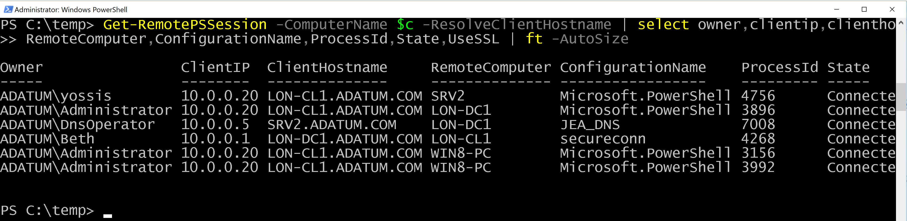

Gets real-time status & information about WS-Man connections/PS-Sessions (local, remote, windows powershell and pwsh), which user is connected, from which IP/host, how long and if idle, and much more.

Useful for mapping/hunting for PSRemoting sessions in an enterprise, among other use cases. 

Information includes:
* Owner (Domain\Username)
* ClientIP
* ClientHostname (Optional, as a parameter)
* SessionTime
* IdleTime
* RemoteComputer
* ConfigurationName
* ProcessId
* State
* Port
* UseSSL (Optional. defaults to false)
* Name (SessionName)
* ShellID
* ConnectionURI

